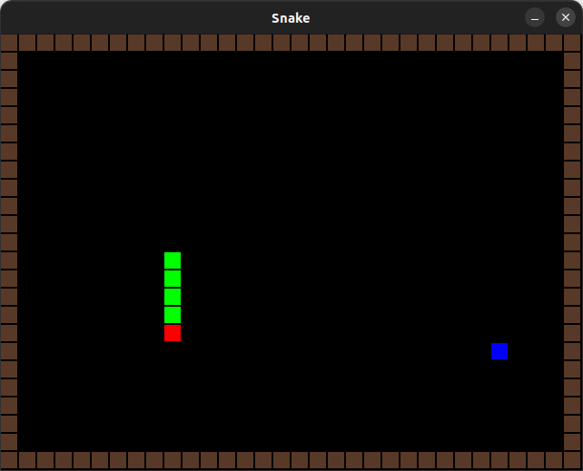

======
Snake
======

This is a simple snake game implementation in C using SDL2. I created this project to better understand C language, SDL and get familiar with procedural programming. The game's functionality is not complete yet, I work on this project in my free time.

Prerequisites
=============

You need to have SDL2 installed on your system. For Debian/Ubuntu based distros.

``sudo apt install libsdl2-dev``

Running the project
===================

To run the project, execute the below command.

``make run``
